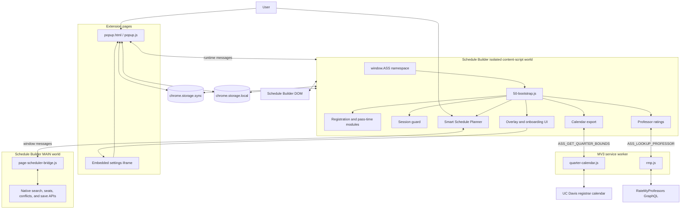
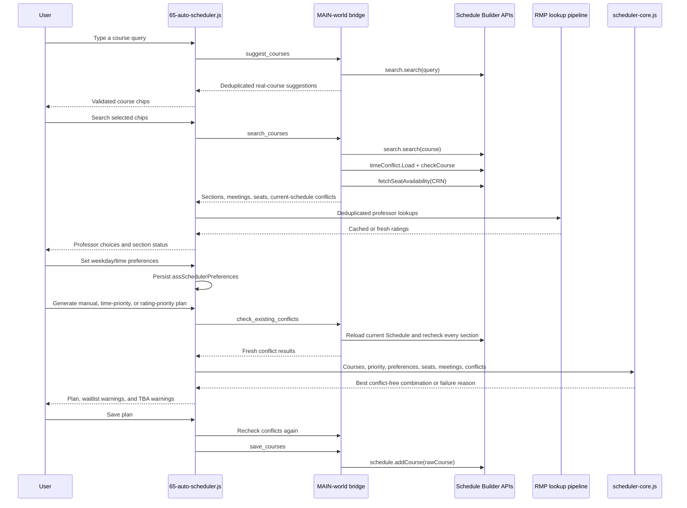

# Architecture

Aggie Schedule Sniper is a Manifest V3 Chrome extension for UC Davis Schedule Builder. Version 3.1 has no build step: Chrome loads the repository files directly from `manifest.json`.

## Runtime topology



## Execution worlds

The extension uses separate JavaScript worlds deliberately.

| World | Code | Capabilities and constraints |
|---|---|---|
| Extension page | `popup.html`, `popup.js` | Full extension APIs; manages settings, developer configuration, cache controls, calendar export requests, and debug-log export. |
| Service worker | `background/quarter-calendar.js`, `background/rmp.js` | Performs cross-origin registrar and RateMyProfessors requests allowed by `host_permissions`; owns their caches and message handlers. |
| Isolated content-script world | Most files under `content/` plus `shared/` helpers | Has Chrome extension APIs and access to the page DOM, but cannot directly read Schedule Builder's JavaScript objects. Modules share `window.ASS` within this isolated world. |
| MAIN content-script world | `content/page-scheduler-bridge.js` | Can call Schedule Builder's native `search`, `schedule`, and `user` objects, but intentionally does not use privileged Chrome APIs. |
| Schedule Builder page | UC Davis application code | Owns course search, live-seat lookup, current-schedule conflict data, and course saving. |

The Smart Schedule Planner crosses the isolated/MAIN boundary through a narrow `window.postMessage` protocol named `ASS_AUTO_SCHEDULER_BRIDGE_V1`. This avoids exposing general page execution to the extension.

## Script loading and shared namespace

`manifest.json` declares two content-script entries.

1. `content/page-scheduler-bridge.js` loads in the `MAIN` world at `document_idle`.
2. The isolated-world scripts load in this order:

```text
branding/official.js
shared/config-schema.js
shared/extension-context.js
shared/clipboard.js
shared/scheduler-core.js
content/00-namespace.js
content/05-config.js
content/10-debug.js
content/20-pass-times.js
content/30-registration.js
content/35-session-keepalive.js
shared/ics.js
content/25-schedule-parse.js
content/26-quarter-dates.js
content/55-calendar-export.js
content/ui/styles.js
content/60-professor-ratings.js
content/65-auto-scheduler.js
content/40-overlay-ui.js
content/45-onboarding.js
content/50-bootstrap.js
```

`content/00-namespace.js` creates `window.ASS` with four primary areas:

- `config`: runtime defaults plus developer overrides.
- `state`: settings, pass tracking, registration attempts, and session state.
- `ui`: references to injected UI nodes.
- `api`: functions registered by later modules with `Object.assign()`.

`content/50-bootstrap.js` is the orchestrator. After settings load, it starts the render interval, initializes UI, watches storage changes, and invokes feature modules through `ASS.api`.

## Core data flows

### Settings, pass times, and automatic registration

1. The popup stores `autoRegister`, `showCountdown`, `keepSessionAlive`, `keepScreenAwake`, `showProfessorRatings`, and `showSmartSchedulePlanner` in `chrome.storage.sync`.
2. `50-bootstrap.js` loads those values and polls every `renderIntervalMs` (500 ms by default).
3. `20-pass-times.js` reads visible pass-time text and parses Pacific timestamps. Parsed results are cached briefly to tolerate transient DOM rerenders.
4. A pass becomes active only after the current page instance observes its opening time. This guards against immediately clicking after opening an already-active pass page.
5. `30-registration.js` finds a Register or Register ALL control, dispatches a click sequence, checks page-state success heuristics, and retries using configured backoff delays.
6. Registration attempts and outcomes are written to the extension-scoped debug ring.

The `?ucdTest=N` or `#ucdTest=N` helper replaces DOM pass times with a simulated pass opening in `N` seconds.

### Session guard

While automatic registration is armed, `35-session-keepalive.js` can:

- send authenticated keepalive requests to UC Davis at the configured interval;
- click a visible Continue Session control with a cooldown;
- acquire a screen wake lock while the tab is visible;
- run a catch-up keepalive when the tab becomes visible again; and
- release timers and wake locks when disarmed or when the page is hidden/unloaded.

The guard runs only in the top frame.

### Professor ratings

1. `60-professor-ratings.js` observes saved courses and search-result containers for instructor links.
2. Instructor names are normalized and deduplicated. Lookups use a bounded concurrency queue.
3. The content script sends `ASS_LOOKUP_PROFESSOR` to the service worker.
4. `background/rmp.js` searches RateMyProfessors GraphQL using the UC Davis school ID and matches first initial plus last-name parts.
5. Successful results and confirmed misses are cached in `chrome.storage.local`; transient failures are not persisted as permanent misses.
6. The same lookup API is reused by the Smart Schedule Planner.

### Smart Schedule Planner



Planner rules and priorities:

1. A requested course must contribute exactly one section.
2. `Open 0 / Waitlist 0` sections are hard-excluded.
3. Sections conflicting with the current Schedule Builder schedule are hard-excluded.
4. Remaining sections must not overlap one another on any meeting day.
5. Sections overlapping a time block marked `Never` are hard-excluded. TBA meetings cannot be evaluated against this rule and remain visibly warned.
6. Open sections rank above waitlist-only sections; known availability ranks above unknown availability. These availability tiers dominate every preference score.
7. Time quality combines duration-weighted weekday fit (35%) and time-block fit (65%). With no preferred weekdays, only time-block fit is used.
8. Time Priority weights time quality 100:1 over normalized RMP rating; Rating Priority reverses those weights. The secondary dimension therefore breaks ties and close cases without overriding the selected primary dimension.
9. Manual-professor mode still uses time quality first among the chosen professor's eligible sections and RMP as a small secondary score.
10. Search uses branch-and-bound with a 250,000-step default exploration ceiling and reports when a result may not be globally optimal.

Current-schedule conflicts are checked during search and refreshed before plan generation, GPT prompt copying, and saving. Saving adds sections to Schedule Builder but never clicks Register.

TBA meetings cannot be proven conflict-free. They remain eligible but produce a visible warning. Final-exam data is included in the GPT prompt; the solver currently checks recurring class meetings, not final-exam overlap.

### Calendar export

1. `25-schedule-parse.js` reads registered and waitlisted course cards from the current Schedule Builder DOM.
2. It extracts course metadata, recurring meetings, notes, and per-course final-exam data.
3. `26-quarter-dates.js` requests instruction bounds from the service worker.
4. `background/quarter-calendar.js` fetches and parses the registrar quarter calendar, caches it, and maps the Schedule Builder term to the correct registrar column.
5. If registrar dates cannot be resolved, `55-calendar-export.js` prompts for manual instruction dates.
6. `shared/ics.js` creates timezone-aware `America/Los_Angeles` events and recurrence rules.
7. `55-calendar-export.js` previews the schedule and downloads the `.ics` file or guides the user through Google Calendar import.

### Popup, overlay, and onboarding

- The browser-action popup and the embedded settings iframe share `popup.html` and `popup.js`. Their Smart Schedule Planner toggle adds or removes the native-search launcher and hides the planner modal immediately through the sync-storage listener in `50-bootstrap.js`.
- `40-overlay-ui.js` injects the floating status bar and opens the embedded popup or developer panel.
- `45-onboarding.js` owns the first-run/how-it-works modal.
- Popup-to-content actions use `chrome.tabs.sendMessage` when opened as a browser action and parent-window messages when embedded.
- `?assReset=1` or `#assReset=1` clears the onboarding dismissal for testing.

## Message contracts

### Chrome runtime messages

| Message | Sender | Receiver | Purpose |
|---|---|---|---|
| `ASS_LOOKUP_PROFESSOR` | Professor ratings content module | Service worker | Fetch one RateMyProfessors record. |
| `ASS_GET_QUARTER_BOUNDS` | Quarter-dates content module | Service worker | Get cached or fresh instruction dates for a term. |
| `ASS_REFETCH_QUARTER_CALENDAR` | Developer popup | Service worker | Force-refresh registrar data. |
| `ASS_CLEAR_QUARTER_CALENDAR_CACHE` | Developer popup | Service worker | Remove registrar cache. |
| `ASS_CLEAR_RMP_CACHE` | Developer popup | Service worker | Remove professor caches. |
| `ASS_CLEAR_ALL_CACHES` | Developer popup | Service worker | Clear registrar and professor caches. |
| `ASS_EXPORT_LOGS` | Popup | Content script | Merge and return extension debug logs. |
| `ASS_EXPORT_CALENDAR` / `ASS_DOWNLOAD_ICS` | Popup | Content script | Start calendar export. |
| `ASS_SHOW_ONBOARDING` | Popup | Content script | Show onboarding in the top frame. |
| `ASS_OPEN_DEV_MENU` | Popup | Content script | Open the embedded developer panel. |
| `ASS_OPEN_SMART_PLANNER` | Popup | Smart Planner content module | Open the shared planner modal from the browser-action popup. |

### Smart planner MAIN-world bridge

All bridge messages use channel `ASS_AUTO_SCHEDULER_BRIDGE_V1`, a request ID, and request/response direction markers.

| Action | Purpose |
|---|---|
| `ping` | Report whether the page search API is ready. |
| `suggest_courses` | Return up to 15 deduplicated real-course matches without seat lookups. |
| `search_courses` | Run native course search, live-seat lookup, and initial current-schedule conflict checks. |
| `check_existing_conflicts` | Reload the current Schedule and recheck remembered raw course objects. |
| `save_courses` | Save remembered raw course objects through `schedule.addCourse()`. |

The bridge remembers raw search objects by CRN (or hidden CRN for consent-required courses) because Schedule Builder requires its original object shape when saving. Autocomplete uses a separate lightweight `suggest_courses` action that deduplicates at the course level and does not request live seats until the user searches the selected chips.

## Storage model

| Area | Key | Purpose |
|---|---|---|
| `sync` | `autoRegister` | Enable automatic Register clicking. |
| `sync` | `showCountdown` | Show pass countdown. |
| `sync` | `keepSessionAlive` | Enable keepalive and Continue Session handling. |
| `sync` | `keepScreenAwake` | Enable wake lock while armed. |
| `sync` | `showProfessorRatings` | Enable RMP cards and lookups. |
| `sync` | `showSmartSchedulePlanner` | Enable popup launch and show the Schedule Builder search launcher. |
| `local` | `assAdvancedConfig` | Developer overrides from `shared/config-schema.js`. |
| `local` | `assQuarterCalendarCache` | Parsed registrar quarter dates and fetch timestamp. |
| `local` | `assRmpCache`, `assRmpMiss` | RMP hits and confirmed misses with TTL metadata. |
| `local` | `assAutoSchedulerCourses` | Validated Smart Schedule Planner course chips. |
| `local` | `assSchedulerPreferences` | Preferred weekdays and per-time-block preference levels. |
| `local` | `assOnboardingDismissed_v3` | Onboarding dismissal. |
| `local` | `assDbgInst_<instance>` | Per-frame debug ring snapshots, pruned after 48 hours. |

## Module layout

### Extension pages and background

| File | Role |
|---|---|
| `manifest.json` | MV3 entry points, permissions, match patterns, script order, and accessible resources. |
| `branding/official.js` | Official URLs and branding; forks replace this file. |
| `popup.html`, `popup.css`, `popup.js` | Browser action, embedded settings, developer configuration, cache actions, and content-script commands. |
| `background/quarter-calendar.js` | Service-worker entry point, registrar cache/parser, and runtime message router. |
| `background/rmp.js` | RateMyProfessors GraphQL lookup and professor-name matching. |

### Shared modules

| File | Role |
|---|---|
| `shared/config-schema.js` | Default advanced configuration and developer-field metadata. |
| `shared/extension-context.js` | Guards calls after an extension reload invalidates a content-script context. |
| `shared/clipboard.js` | Clipboard API plus `execCommand` fallback. |
| `shared/ics.js` | Pure ICS/date/time helpers used by calendar export. |
| `shared/scheduler-core.js` | Pure course normalization, availability classification, time/RMP scoring, conflict solver, and GPT prompt generation. |

### Content scripts

| File | Role |
|---|---|
| `content/page-scheduler-bridge.js` | Top-frame MAIN-world adapter for native Schedule Builder APIs. |
| `content/00-namespace.js` | Creates `window.ASS`, defaults, runtime state, and test URL helpers. |
| `content/05-config.js` | Loads and applies `assAdvancedConfig` overrides. |
| `content/10-debug.js` | Extension-scoped ring logs, persistence, pruning, and log export. |
| `content/20-pass-times.js` | Pacific pass-time parsing, caching, selection, countdown, and activation tracking. |
| `content/25-schedule-parse.js` | Parses registered/waitlisted course cards for export. |
| `content/26-quarter-dates.js` | Requests term boundaries from the service worker. |
| `content/30-registration.js` | Register button discovery, click retries, and success heuristics. |
| `content/35-session-keepalive.js` | Keepalive requests, Continue Session handling, and wake lock. |
| `content/40-overlay-ui.js` | Floating status bar, embedded popup, and developer-panel hosts. |
| `content/45-onboarding.js` | First-run and manually opened onboarding modal. |
| `content/50-bootstrap.js` | Frame gate, settings initialization, render loop, and storage/message listeners. |
| `content/55-calendar-export.js` | Calendar preview, manual-date fallback, ICS download, and export buttons. |
| `content/60-professor-ratings.js` | Instructor discovery, lookup queue, cache synchronization, and RMP cards. |
| `content/65-auto-scheduler.js` | Planner modal and launchers, autocomplete chips, Advanced Settings, page-bridge client, RMP aggregation, rechecks, plan rendering, prompt copying, and saving. |
| `content/ui/styles.js` | Shared inline style constants for overlay UI. |

## Permissions and trust boundaries

- `storage` supports synchronized settings and local caches.
- `clipboardWrite` supports share links, debug logs, and GPT prompt copying.
- Registrar host access is used only by the service worker for quarter dates.
- RateMyProfessors host access is used only by the service worker lookup module.
- The MAIN-world bridge exposes only search, conflict-check, and save actions. It does not expose registration and has no Chrome API access.
- Course saving requires an explicit user click. Registration remains a separate pass-time-controlled feature.

## Frames

Both content-script entries use `all_frames: true` because Schedule Builder can host relevant UI in a child frame.

- `page-scheduler-bridge.js` and `65-auto-scheduler.js` explicitly run only in the top frame.
- `50-bootstrap.js` runs in the top frame or a child frame containing known Schedule Builder anchors; irrelevant frames exit early.
- Session guard and modal hosts are top-frame-only.
- RMP and calendar modules can observe the frame selected by the bootstrap gate.

## Testing

Run the pure and bridge tests with:

```bash
node --test tests/*.test.js
```

Current coverage includes:

- course-code parsing and normalization;
- live-seat availability classification;
- Schedule Builder search-result normalization;
- requested-course meeting conflict detection;
- hard exclusion of `0/0` and current-Schedule conflicts;
- manual-professor, time-priority, and rating-priority plan selection;
- secondary-weight tie-breaking and hard Never-time exclusions;
- GPT prompt content; and
- MAIN-world search, conflict, seat, and save message handling.

Manual test helpers:

- `?ucdTest=N` or `#ucdTest=N`: simulate a pass opening in `N` seconds.
- `?assReset=1` or `#assReset=1`: reset onboarding.
- Popup footer **Copy debug logs**: export extension-scoped logs from the active Schedule Builder tab.

After changing source files, reload the unpacked extension at `chrome://extensions` and refresh Schedule Builder. Planner testing should use a temporary Schedule so current-schedule conflict behavior and saving can be verified safely.
