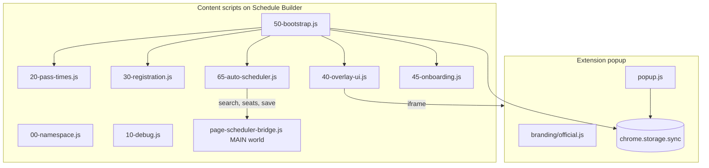

# Architecture

Aggie Schedule Sniper is a Manifest V3 Chrome extension with no build step.

## Components

## Data flow

1. **Popup** reads/writes `autoRegister` and `showCountdown` in `chrome.storage.sync`.
2. **Content script** (`50-bootstrap.js`) polls every 500ms, parses pass times from the page DOM, and renders the floating bar.
3. When a pass window is active and auto-register is on, **registration** (`30-registration.js`) finds and clicks the Register control with retries.
4. Clicking the floating bar opens an **embedded iframe** loading `popup.html?embedded=1`.

## Module layout

| File | Role |
|------|------|
| `branding/official.js` | Official URLs ([ass.vijit.app](https://ass.vijit.app), [vijitdua.com](https://vijitdua.com)); forks replace this |
| `content/00-namespace.js` | `window.ASS` config, state, UI handles |
| `content/10-debug.js` | Ring buffer logs, export for support |
| `content/20-pass-times.js` | Parse Pacific pass times, track selected pass |
| `content/30-registration.js` | Register button discovery and click waves |
| `content/40-overlay-ui.js` | Floating UI and settings panel |
| `content/page-scheduler-bridge.js` | Narrow MAIN-world bridge to Schedule Builder's search, live-seat, and save APIs |
| `shared/scheduler-core.js` | Pure course normalization, conflict solver, and GPT prompt generation |
| `content/65-auto-scheduler.js` | Smart planner UI, RMP aggregation, course collection, and generated-plan saving |
| `content/45-onboarding.js` | First-run modal (`assOnboardingDismissed` in local storage) |
| `content/50-bootstrap.js` | Entry point, render loop, storage listeners |

Scripts load in manifest order; all modules share `window.ASS`.

## Testing

- `?ucdTest=N` or `#ucdTest=N` — simulates a pass opening in N seconds (see `content/00-namespace.js`).
- `?assReset=1` or `#assReset=1` — clears onboarding dismissal and shows the welcome modal again.
- Debug logs: popup footer **Copy debug logs** (requires Schedule Builder tab active).

## Frames

`all_frames: true` is required for Schedule Builder shells that host the UI in a child frame. `shouldRunContentScriptInThisFrame()` skips irrelevant iframes.
