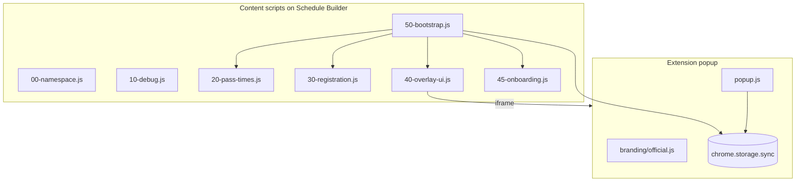

# Architecture

Aggie Schedule Sniper is a Manifest V3 Chrome extension with no build step.

## Components

## Data flow

1. **Popup** reads/writes `autoRegister` and `showCountdown` in `chrome.storage.sync`.
2. **Content script** (`50-bootstrap.js`) polls every 500ms, parses pass times from the page DOM, and renders the floating bar.
3. When a pass window is active and auto-register is on, **registration** (`30-registration.js`) finds and clicks the Register control with retries.
4. Clicking the floating bar opens an **embedded iframe** loading `popup.html?embedded=1`.

## Module layout

| File | Role |
|------|------|
| `branding/official.js` | Official URLs ([ass.vijit.app](https://ass.vijit.app), [vijitdua.com](https://vijitdua.com)); forks replace this |
| `content/00-namespace.js` | `window.ASS` config, state, UI handles |
| `content/10-debug.js` | Ring buffer logs, export for support |
| `content/20-pass-times.js` | Parse Pacific pass times, track selected pass |
| `content/30-registration.js` | Register button discovery and click waves |
| `content/40-overlay-ui.js` | Floating UI and settings panel |
| `content/45-onboarding.js` | First-run modal (`assOnboardingDismissed` in local storage) |
| `content/50-bootstrap.js` | Entry point, render loop, storage listeners |
| `content/65-advanced-planner.js` | Advanced Planner wizard: course chips, preference steps, section-by-section selection |
| `content/ui/planner-styles.js` | Advanced Planner stylesheet |
| `content/page-scheduler-bridge.js` | MAIN-world adapter for Schedule Builder's own APIs |
| `shared/scheduler-core.js` | Pure course normalization, conflict detection, and the schedule solver |

Scripts load in manifest order; all modules share `window.ASS`.

## Advanced Planner

The planner collects courses, then preferred times, then preferred days, then how
much professor ratings should count. Every preference is a 0-4 slider position;
none of them exclude a section outright. `generateSchedules()` then ranks
combinations of one section per course and returns the best few.

Results are built section by section: selecting a course locks that section into
a selected tray, re-ranks remaining options around it, and hides selected
courses from the choice list while keeping them greyed on other option
calendars. Save is enabled only once every course is selected.

Nothing is filtered out by preferences. Instead each section carries a
`LIMIT_COST` for what it makes you give up — unknown seat counts, waitlist-only,
clashing with a *different* course you already saved, no seats at all — and any
cost outranks every quality difference, so a compromised option can never beat a
clean one but is still returned when there is nothing better. Overlapping
classes are rejected on the first pass and only penalized on a retry. Each
option reports the `limits` it hit, which feeds the results banner and
per-option warnings.

Because the search is pure and in-memory, selecting or unselecting a section
immediately recomputes every option with those sections fixed; no new page
requests are made.

Content scripts cannot read Schedule Builder's `search` / `schedule` / `user`
objects, so `content/page-scheduler-bridge.js` runs in the MAIN world and relays
actions over `window.postMessage` on channel `ASS_ADVANCED_PLANNER_BRIDGE_V1`:
`suggest_courses`, `search_courses`, `check_existing_conflicts`,
`get_course_details`, and `save_courses`. Saving always requires a user click.
`save_courses` replaces only an unregistered section of the same course and
skips registered/waitlisted courses while still saving the rest.

Settings live under `showAdvancedPlanner` (`sync`), with chips and preferences
cached in `assAdvancedPlannerCourses` / `assAdvancedPlannerPreferences`
(`local`).

## Testing

- `node --test tests/*.test.js` — covers the scheduler solver and the MAIN-world bridge.
- `?ucdTest=N` or `#ucdTest=N` — simulates a pass opening in N seconds (see `content/00-namespace.js`).
- `?assReset=1` or `#assReset=1` — clears onboarding dismissal and shows the welcome modal again.
- Debug logs: popup footer **Copy debug logs** (requires Schedule Builder tab active).

## Frames

`all_frames: true` is required for Schedule Builder shells that host the UI in a child frame. `shouldRunContentScriptInThisFrame()` skips irrelevant iframes.
